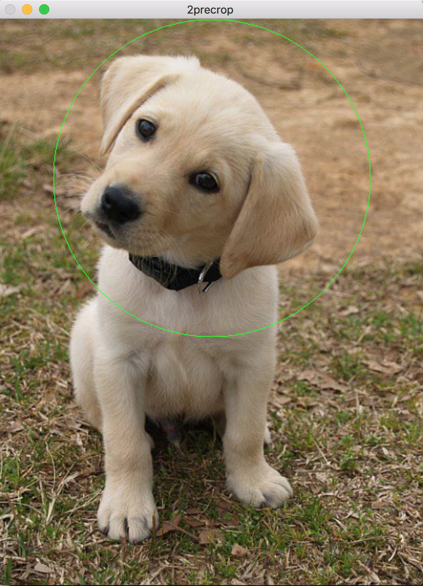
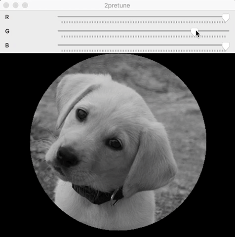
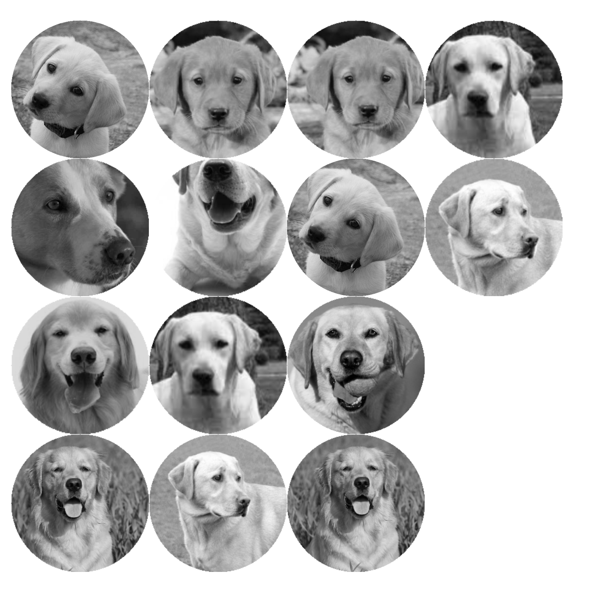

# Batch Image Processing

A Batch Image Processing GUI that outputs Printer-ready compiled sheets of images. In the current iteration, the user can crop an image into a circle, and adjust the Black & White filter by using an intuitive GUI that runs on OpenCV.

## Getting Started

These instructions will get you a copy of the project up and running on your local machine for development and testing purposes. See deployment for notes on how to deploy the project on a live system.

### Prerequisites
* An fresh installation of [OpenCV](https://opencv.org/)
* [Pip](https://pip.pypa.io/en/stable/)

### Installing

In order to install, open your virtual environment where you installed OpenCV, and then pip-install the requirements for the script.

```
$ workon cv
(cv)$ pip install -r requirements.txt

```

### Deploying

Now you are ready to run the batchImgProc.py script. Locate the origin folder for the images to process, and the output for where to save the results.

```
(cv)$ cd /Path/to/Script/
(cv) Path/to/Script/ $ python batchImgProc.py -i /Users/Path/to/Images/Folder/ -o /Users/Path/to/Output/Folder/
```

## Usage
The program allows the user to batch process all images in a given input folder
### User Processing
#### Crop to Circle
By clicking and holding the mouse, the script captures and makes a circle around the beginning and end-points.
After each circle is drawn, the user can either:
* Press [A] to accept the crop and move to the next step
* Press [D] to decline the crop and restart
* Or continue to draw test circles



#### Apply Black & White Filter
By using the sliding scales, the script enables the user to decide on the amounts of R, G, B color channels to show in the output.
After each update to the sliders:
* Press [A] to accept the filter and continue to the next image
* Press [D] to decline the filter and restart
* Or continue to test filter parameters


### Compilation
After all the images have been processed, the computer resizes them and compiles them to a printer ready sheet.


## Built With

* [OpenCV](https://opencv.org/) - Open Source Computer Vision Library
* [Pip](https://pip.pypa.io/en/stable/) - Dependency Management
